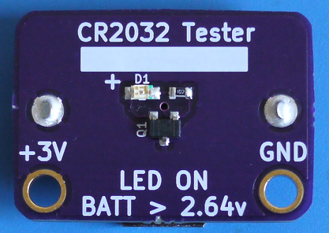

# CR2032 Battery Tester

Test your CR2032 coin cells using this breakout. Below 2.64v, the LED ceases to
light, indicating that the coin cell is nearing the end of its useful life.

## Bill of Materials

This builds 1 board. You'll get at least 3 from OSHPark.

| Quantity | Description | Digikey/Mouser Part Number | Board Placement |
| -------- | ----------- | ------------------- | --------------- |
| 1 | TPS3809L30DBVR | [296-10917-1-ND](http://www.digikey.com/product-detail/en/TPS3809L30DBVR/296-10917-1-ND) / [595-TPS3809L30DBVR](http://www.mouser.com/access/?pn=595-TPS3809L30DBVR) | Q1 |
| 1 | 20mm coin cell holder (through-hole) | [3003K-ND](http://www.digikey.com/product-detail/en/3003/3003K-ND) / [534-3003](http://www.mouser.com/access/?pn=534-3003) | Rear |
| 1 | 0603 imperial series resistor for LED | Generic value\*\* | R1 |
| 1 | 0805 imperial LED | Generic/Any type\*\*\* | D1 |

I used the following parts for these, but you should really source to your
desired quantity:

\*\* 1k 0603 resistor (from the spare parts bin, if you really want one though..
[RMCF0603JT1K00CT-ND](http://www.digikey.com/product-detail/en/RMCF0603JT1K00/RMCF0603JT1K00CT-ND).
Try another part and order a bunch for a better discount / price.)

\*\*\* Mouser
[645-598-8130-107F](http://www.mouser.com/access/?pn=645-598-8130-107F) (Orange
Dialight LED, Vf=1.7V, If=20mA)

## Fabrication

[OSHPark shared project here](https://oshpark.com/shared_projects/Qcq4ZSKX)

## License

Creative Commons CC0 1.0 Universal

## Trivia

This board is actually a mashup of Chris Gammell's and Dave Jones' projects. The
coin cell holder and layout comes from the free Getting to Blinky KiCAD
tutorial. The part and usage is derived from Dave Jones' µCurrent.  

The battery contact area was inspired by Adafruit's Ultimate GPS Breakout (leaving the
purple soldermask causes the copper ENIG contact area to be in-set, preventing
an inserted battery from making proper contact).
